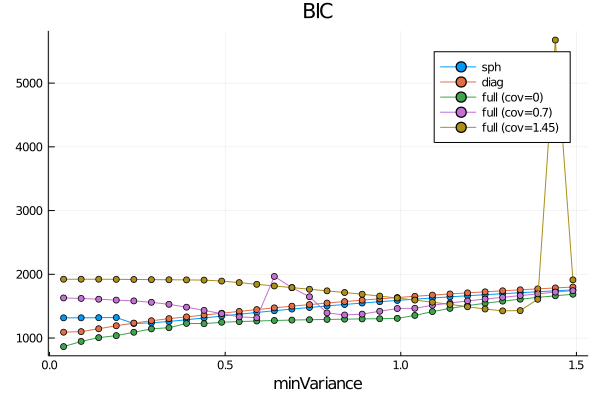
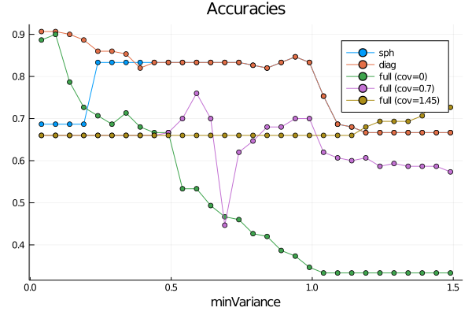

#  BetaML.jl Documentation

Welcome to the documentation of the [_Beta Machine Learning toolkit_](https://github.com/sylvaticus/BetaML.jl).


## Installation

The BetaML package is now included in the standard Julia register, install it with:
* `] add BetaML`

## Loading the module(s)

This package is split in several submodules. You can access its functionality either by `using` the specific submodule of interest and then directly the provided functionality (utilities are re-exported by each of the other submodules, so normally you don't need to implicitly import them) or by `using` the root module `BetaML` and then prefix with `BetaML.` each object/function you want to use, e.g.:

```julia
using BetaML.Nn
myLayer = DenseLayer(2,3)
```

or, equivalently,

```julia
using BetaML
res = BetaML.kernelPerceptron([1.1 2.1; 5.3 4.2; 1.8 1.7], [-1,1,-1])
```

## Usage

Documentation for most algorithms can be retrieved using the inline Julia help system (just press the question mark `?` and then, on the special help prompt `help?>`, type the function name).

For a list of supported algorithms please look at the individual modules:

- [**`BetaML.Perceptron`**](Perceptron.html): Perform classification tasks using the Perceptron, Kernel Perceptron or Pegasus algorithms
- [**`BetaML.Nn`**](Nn.html): Implementation of Artificial Neural networks
- [**`BetaML.Clustering``**](Clustering.html): Clustering algorithms (Kmeans, Mdedoids, GMM) and collaborative filtering /recommandation systems using clusters
- [**`BetaML.Utils``**](Utils.html): Various utility functions (scale, one-hot, distances, kernels,..)

## Examples

- **Using an Artificial Neural Network for multinomial categorisation**

```julia
# Load Modules
using BetaML.Nn, DelimitedFiles, Random, StatsPlots # Load the main module and ausiliary modules
Random.seed!(123); # Fix the random seed (to obtain reproducible results)

# Load the data
iris     = readdlm(joinpath(dirname(Base.find_package("BetaML")),"..","test","data","iris.csv"),',',skipstart=1)
iris     = iris[shuffle(axes(iris, 1)), :] # Shuffle the records, as they aren't by default
x        = convert(Array{Float64,2}, iris[:,1:4])
y        = map(x->Dict("setosa" => 1, "versicolor" => 2, "virginica" =>3)[x],iris[:, 5]) # Convert the target column to numbers
y_oh     = oneHotEncoder(y) # Convert to One-hot representation (e.g. 2 => [0 1 0], 3 => [0 0 1])

# Split the data in training/testing sets
ntrain    = Int64(round(size(x,1)*0.8))
xtrain    = x[1:ntrain,:]
ytrain    = y[1:ntrain]
ytrain_oh = y_oh[1:ntrain,:]
xtest     = x[ntrain+1:end,:]
ytest     = y[ntrain+1:end]

# Define the Artificial Neural Network model
l1   = DenseLayer(4,10,f=relu) # Activation function is ReLU
l2   = DenseLayer(10,3)        # Activation function is identity by default
l3   = VectorFunctionLayer(3,3,f=softMax) # Add a (parameterless) layer whose activation function (softMax in this case) is defined to all its nodes at once
mynn = buildNetwork([l1,l2,l3],squaredCost,name="Multinomial logistic regression Model Sepal") # Build the NN and use the squared cost (aka MSE) as error function

# Training it (default to SGD)
res = train!(mynn,scale(xtrain),ytrain_oh,epochs=100,batchSize=6) # Use optAlg=SGD (Stochastic Gradient Descent) by default

# Test it
ŷtrain        = predict(mynn,scale(xtrain))   # Note the scaling function
ŷtest         = predict(mynn,scale(xtest))
trainAccuracy = accuracy(ŷtrain,ytrain,tol=1) # 0.983
testAccuracy  = accuracy(ŷtest,ytest,tol=1)   # 1.0

# Visualise results
testSize = size(ŷtest,1)
ŷtestChosen =  [argmax(ŷtest[i,:]) for i in 1:testSize]
groupedbar([ytest ŷtestChosen], label=["ytest" "ŷtest (est)"], title="True vs estimated categories") # All records correctly labelled !
plot(0:res.epochs,res.ϵ_epochs, ylabel="epochs",xlabel="error",legend=nothing,title="Avg. error per epoch on the Sepal dataset")
```


- **Using the expectation-Maximisation algorithm for clustering**

```julia
using BetaML.Clustering, DelimitedFiles, Random, StatsPlots # Load the main module and ausiliary modules
Random.seed!(123); # Fix the random seed (to obtain reproducible results)

# Load the data
iris     = readdlm(joinpath(dirname(Base.find_package("BetaML")),"..","test","data","iris.csv"),',',skipstart=1)
iris     = iris[shuffle(axes(iris, 1)), :] # Shuffle the records, as they aren't by default
x        = convert(Array{Float64,2}, iris[:,1:4])
x        = scale(x) # normalise all dimensions to (μ=0, σ=1)
y        = map(x->Dict("setosa" => 1, "versicolor" => 2, "virginica" =>3)[x],iris[:, 5]) # Convert the target column to numbers

# Get some ranges of minVariance and minCovariance to test
minVarRange = collect(0.04:0.05:1.5)
minCovarRange = collect(0:0.05:1.45)
minCovarRange[15]

# Run the em algorithm for the various cases...
sphOut  = [em(x,3,mixtures=[SphericalGaussian() for i in 1:3],minVariance=v, minCovariance=cv, verbosity=NONE) for v in minVarRange, cv in minCovarRange[1:1]]
diagOut  = [em(x,3,mixtures=[DiagonalGaussian() for i in 1:3],minVariance=v, minCovariance=cv, verbosity=NONE)  for v in minVarRange, cv in minCovarRange[1:1]]
fullOut = [em(x,3,mixtures=[FullGaussian() for i in 1:3],minVariance=v, minCovariance=cv, verbosity=NONE)  for v in minVarRange, cv in minCovarRange]

# Get the Bayesian information criterion (AIC is also available)
sphBIC = [sphOut[v,cv].BIC for v in 1:length(minVarRange), cv in 1:1]
diagBIC = [diagOut[v,cv].BIC for v in 1:length(minVarRange), cv in 1:1]
fullBIC = [fullOut[v,cv].BIC for v in 1:length(minVarRange), cv in 1:length(minCovarRange)]

# Compare the accuracy with true categories
sphAcc  = [accuracy(sphOut[v,cv].pₙₖ,y,ignoreLabels=true) for v in 1:length(minVarRange), cv in 1:1]
diagAcc = [accuracy(diagOut[v,cv].pₙₖ,y,ignoreLabels=true) for v in 1:length(minVarRange), cv in 1:1]
fullAcc = [accuracy(fullOut[v,cv].pₙₖ,y,ignoreLabels=true) for v in 1:length(minVarRange), cv in 1:length(minCovarRange)]

plot(minVarRange,[sphBIC diagBIC fullBIC[:,1] fullBIC[:,15] fullBIC[:,30]], markershape=:circle, label=["sph" "diag" "full (cov=0)" "full (cov=0.7)" "full (cov=1.45)"], title="BIC", xlabel="minVariance")
plot(minVarRange,[sphAcc diagAcc fullAcc[:,1] fullAcc[:,15] fullAcc[:,30]], markershape=:circle, label=["sph" "diag" "full (cov=0)" "full (cov=0.7)" "full (cov=1.45)"], title="Accuracies", xlabel="minVariance")
```






- **Further examples**

We also provide [some Jupyter notebooks](Notebooks.html) that can be run online without installing anything, so you can start playing with the library in minutes.

## Acknowledgements

The development of this package at the _Bureau d'Economie Théorique et Appliquée_ (BETA, Nancy) was supported by the French National Research Agency through the [Laboratory of Excellence ARBRE](http://mycor.nancy.inra.fr/ARBRE/), a part of the “Investissements d'Avenir” Program (ANR 11 – LABX-0002-01).

[](hhttp://www.beta-umr7522.fr/)
